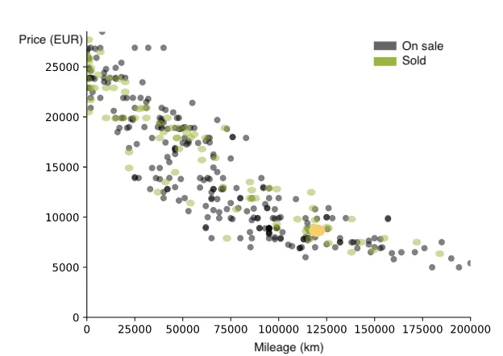

# React.js Coding Challenge: Scatter Plot Diagram with Mileage and Price Data

Your task is to create a React application that reads in a set of input data containing car information, including mileage and price, and displays a scatter plot diagram. Here are the requirements:

## Requirements
* The application should consist of a single page with a header and a content area.
* The header should contain a title that says "Scatter Plot Diagram".
* The content area should contain a plot area where the scatter plot diagram is displayed.
* The input data should be provided as an array of objects, where each object represents a car and has a mileage and a price property.
* The plot area should display a scatter plot of the input data, with the mileage and price values on the horizontal and vertical axes, respectively.
* The plot should be scaled such that the maximum and minimum mileage and price values are visible.
* The plot should have axis labels for both the mileage and price axes.
* The plot should have a legend that indicates the status (on sale or sold) of each car.

## Guidelines
* Use React.js and a visualization library like D3.js to build the application.
* Use CSS to style the application. You can use any CSS framework of your choice or write your own CSS.
* Use git to track your changes and upload the final project to GitHub or a similar hosting service.
* Write clean, readable code and follow best practices.
* Data for this challenge: [car-data.json](car-data.json)

## Bonus Points
If you want to go the extra mile, you can add additional features to the application. Here are some suggestions:
* Add the tooltip that displays the mileage and price values of a car when the user hovers over it with the mouse.
* Add the ability to zoom in and out of the plot area.
* Add the ability to filter the cars based on some criteria, such as the status, year or mileage.

## Example

**Good luck, and have fun!**